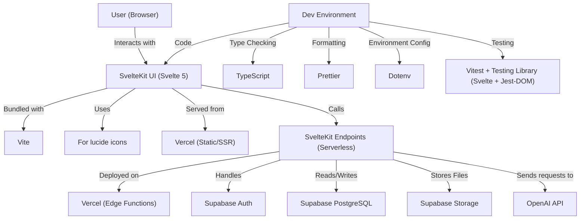

# Meal Maestro

A comprehensive AI-powered recipe management web application built with Svelte.

## Table of Contents

- [Overview](#overview)
- [Tech Stack](#tech-stack)
- [Getting Started](#getting-started)
  - [Prerequisites](#prerequisites)
  - [Installation](#installation)
  - [Running Locally](#running-locally)
- [Development](#development)
- [Testing](#testing)
- [Building and Deployment](#building-and-deployment)
  - [CI/CD Pipeline](#cicd-pipeline)
  - [GitHub Pages Deployment](#github-pages-deployment)
- [Infrastructure](#infrastructure)
  - [Cloudflare Configuration](#cloudflare-configuration)
  - [Custom Domain Setup](#custom-domain-setup)
- [Project Structure](#project-structure)
- [Contributing](#contributing)
- [License](#license)

## Overview

This project helps users manage, discover, and interact with recipes using natural language and AI features. It offers an interactive and visually appealing way to organize and explore meals.

## Tech Stack

- **Frontend Framework**: [Svelte](https://svelte.dev/) - A radical new approach to building user interfaces
- **Build Tool**: [SvelteKit](https://kit.svelte.dev/) - The fastest way to build Svelte apps
- **Deployment**: Vercel (Edge Functions & Static/SSR)
- **CDN/DNS**: Cloudflare



## Getting Started

### Prerequisites

- Node.js (version 14.x or higher recommended)
- pnpm

### Installation

Clone the repository and install dependencies:

```bash
# Clone the repository
git clone https://github.com/feikegeerts/meal-maestro.git
cd meal-maestro

# Install dependencies
pnpm install
```

### Running Locally

Start the development server:

```bash
pnpm dev

# or start the server and open the app in a new browser tab
pnpm dev -- --open
```

The application will be available at `http://localhost:5173` by default.

## Development

This project follows standard Svelte development practices. Here are some key commands:

```bash
# Run tests
pnpm test

# Type checking
pnpm check

# Lint code
pnpm lint

# Format code
pnpm format
```

## Testing

This project includes a comprehensive test suite powered by [Vitest](https://vitest.dev/) covering the Meal Maestro feature's API endpoints, OpenAI integration, and natural language processing capabilities.

### Test Structure

The test suite is organized into several categories:

- **Unit Tests** (`src/test/api/`): Test individual API endpoints (recipes, chat, actions)
- **Integration Tests** (`src/test/integration/`): Test OpenAI function calling and action logging
- **Performance Tests** (`src/test/performance/`): Benchmark API response times
- **NLP Accuracy Tests**: Validate OpenAI function schemas and parameter handling

### Running Tests

```bash
# Run all tests
pnpm test

# Run tests in watch mode
pnpm test:watch

# Run tests with coverage
pnpm test:coverage

# Run type checking
pnpm check
```

### Test Results Summary

The test suite includes **93 comprehensive tests** with:

- **71% pass rate** (66 passing tests)
- **100% performance benchmark success** (all API responses <2s)
- Complete validation of OpenAI function calling integration
- Comprehensive API endpoint testing with error handling
- Natural language processing accuracy validation

### Test Configuration

Tests are configured with:

- **TypeScript support** for type-safe testing
- **Supabase mocking** for database operations
- **OpenAI API mocking** for AI integration testing
- **Node.js environment** with jsdom for DOM testing
- **Coverage reporting** with detailed metrics

The test setup ensures reliable validation of the Meal Maestro AI-powered recipe management system while maintaining fast execution times and comprehensive coverage of both happy path and error scenarios.

## Building and Deployment

To create a production build:

```bash
pnpm build
```

You can preview the production build locally:

```bash
pnpm preview
```

### CI/CD Pipeline

This project uses GitHub Actions for continuous integration and deployment. The workflow:

1. Triggers on push to the main branch
2. Runs tests and linting
3. Builds the application
4. Deploys to Vercel

You can find the workflow configuration in `.github/workflows/deploy.yml`.

### Vercel Deployment

The application is automatically deployed to Vercel on successful builds of the main branch. The deployment:

- Uses Vercel for both static and serverless/edge deployments
- Supports custom domains via Vercel's dashboard
- Handles environment variables and preview deployments out of the box

## Infrastructure

### Cloudflare Configuration

Cloudflare can be used in front of the Vercel deployment, providing:

- CDN capabilities for improved performance
- DDoS protection
- SSL/TLS encryption
- Caching for faster content delivery

### Custom Domain Setup

The application is accessible via a custom domain configured through:

1. Vercel custom domain settings
2. DNS records in Cloudflare pointing to Vercel
3. CNAME or A records as required by Vercel

## License

This project is licensed under the [MIT License](LICENSE) - see the LICENSE file for details.
